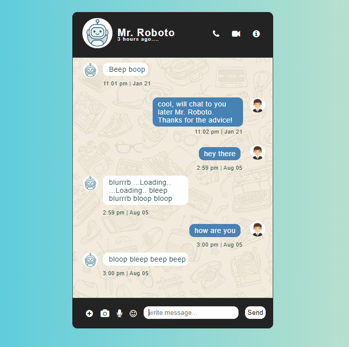

# ChatApp
My first attempt at making an application using HTML, CSS and JS
This project was originally created as an application project for entry to the Codeworks bootcamp based in London.

Enter text and send messages and the program messages back random words from it's limited vocabulary

Link to operational app below:
https://daniel-slattery.github.io/ChatApp/

<>
